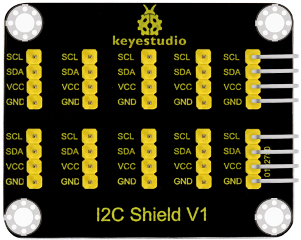
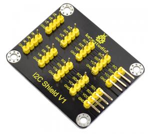
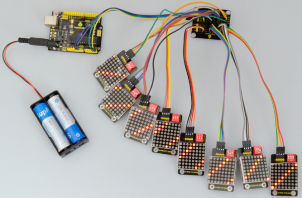

# KS0392 keyestudio I2C Interface Conversion Shield (Black and Eco-friendly)

## 1. Description

This is an I2C interface conversion shield.

When the MCU communicates with other sensor modules, I2C communication mode is required, and I2C communication can be performed simultaneously with multiple sensor modules by changing the address. But general MCU only introduces an I2C communication interface, which is very inconvenient.

With this I2C shield, this trouble can be solved easily.

The I2C shield breaks out the I2C communication port with 4pin header of 2.54mm pitch. The pin headers lead to 10 communication ports, ensuring that the MCU can perform I2C communication with 9 sensor modules at the same time.

## 2. Technical Parameters

- Working voltage: DC 5V
- Communication way: I2C communication
- Pin pitch: 2.54mm
- Environmental attributes: ROHS
- Dimensions: 49.5mm * 40.2mm * 11.7mm
- Weight: 8.5g

## 3. Use Method

We use UNO Control board and I2C shield to control eight keyestudio 8x8 matrix modules (selectable address), showing different images. Shown below.

